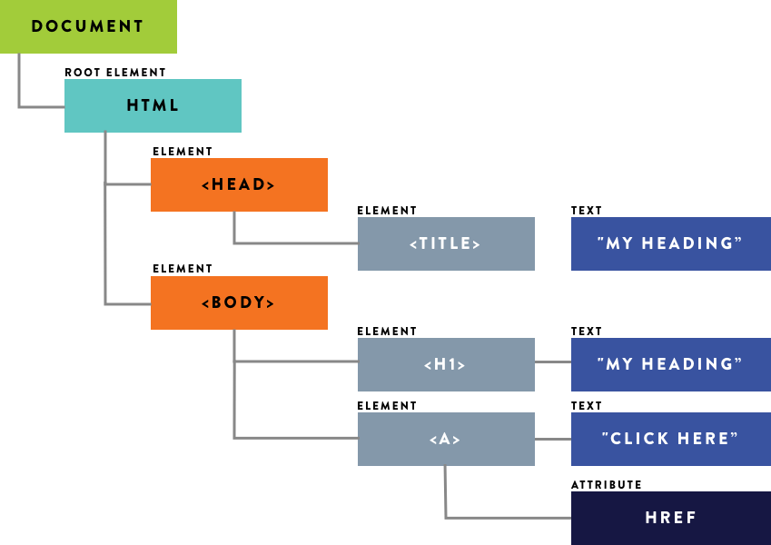

# DOM

DOM 表示 Document Object Model，表示文档对象模型。DOM 是针对 HTML 和 XML 文档的一个 API。

浏览器将 HTML 转化为 DOM 后，使用 DOM API 能操纵 DOM。DOM API 主要功能分为节点/事件/Range/遍历。



上图所示为 HTML 转化为 DOM 的一个典型例子。

## 节点 API

DOM 树形结构中节点相关的 API。节点主要分为：


DOM 与 HTML 写法的对应关系为：

```md
Element: <tagname>...</tagname>
Text: text
Comment: <!-- comments -->
DocumentType: <!Doctype html>
ProcessingInstruction: <?a 1?>
```

### Node

Node 定义了 DOM 节点在 DOM 上的操作。Node 是所有其他节点类型的父类。

#### 属性获取节点的信息

- `nodeValue`: 获取/设置当前节点的值
- `nodeType`: 获取当前节点类型
- `nodeName`: 获取当前节点名称

#### 属性获得当前节点的父/子/兄弟节点

- `parentNode`
- `childNodes`
- `firstChild`
- `lastChild`
- `nextSibling`
- `previousSibing`

#### 方法设置当前节点的子/兄弟节点

注意，以下方法都需要指定父节点。具体用法可参考[这里](https://jsfiddle.net/FrankHuJuventus/nhfr6v8c/)。

- `parentNode.appendChild(newChildNode)`: 用于给当前节点的子节点列表的末尾添加一个节点。注意，如果 newChildNode 已经是文档的一部分了，那相当于将这个节点转移到了新的位置。
- `parentNode.insertBefore(newNode, referenceNode)`: 表示在 parentNode 之下，referenceNode 之前，插入兄弟节点。
- `parentNode.removeChild(referenceNode)`: 表示在 parentNode 之下，移除 referenceNode。
- `parentNode.replaceChild(newNode, referenceNode)`: 表示在 parentNode 之下，将 referenceNode 变为 newNode。

#### 其他高级 API

具体用法可参考[这里](https://jsfiddle.net/FrankHuJuventus/y5w1ab3q/)。

- `node.compareDocumentPosition(otherNode)`: 是一个用于比较两个节点中关系的函数。
- `node.contains(otherNode)` 检查一个节点是否包含另一个节点的函数。
- `node.isEqualNode(otherNode)` 检查两个节点是否完全相同。
- `node.isSameNode(otherNode)` 检查两个节点是否是同一个节点，实际上在 JavaScript 中可以用“===”。
- `node.cloneNode([deep])` 复制一个节点，如果传入参数 true，则会连同子元素做深拷贝。

### Document

Docuemnt 节点表示文档，表示整个 HTML 页面，document 对象表示 Document 节点。开发中，主要使用 document 创建其他类型的节点。

- `document.body`: 获取 body Element 节点
- `document.documentElement`: 获取 html Element 节点
- `document.title`: 获取/设置文档的标题，对应 HTML 中的`<title></title>`
- `document.createElement(tagName[, options])`
- `document.createTextNode(data)`

### Element

Element 节点对应了 HTML 的标签，既有子节点，又有属性(Attribute)。

```html
<h1 class="main">Hello</h1>
```

上面的 HTML 片段对应的 DOM 是 Element 类型，nodeName 为 h1。

该 Element 节点有一个子节点，子节点类型是 Text 类型。

该 Element 节点还有一个属性 class，属性值为 main。

#### 操作 Element 上的 Attribute

- `element.getAttribute(attributeName)`
- `element.setAttribute(name, value)`
- `element.removeAttribute(attrName)`
- `element.hasAttribute(name)`

属性以 Attr 类型表示。Attr 节点也是 Element 节点的子节点，但不被认为是 DOM 的一部分。在一般开发中，不会直接去引用这些 Attr 节点，而是通过使用`element.getAttribute(attributeName)`等方法来得到。

如果追求性能，可以使用如下方法，返回 Attr 类型,该类型是 Node 的子类。

- `element.getAttributeNode(attributeName)`
- `element.setAttributeNode(name, value)`

#### 获得 Element 节点

获得 Element 的节点主要用到 document 对象。其中，`querySelector`的性能较差，`document.getElementsByName`等返回的是一个动态更新的 HTMLCollection。动态更新使每次得到的 Elements 都是最新的。

document 对象获得 Element 的方法：

- `document.querySelector(selectors)`
- `document.querySelectorAll(selectors)`: 获得整个文档模式匹配的 Elements。返回的是一个 NodeList。但是，这个 NodeList 不是动态更新的。
- `element.querySelector(selectors)`: 获得某个 Element 节点下的第一个模式匹配的 Element
- `element.querySelectorAll(selectors)`
- `document.getElementById(id)`
- `document.getElementsByName(name)`
- `document.getElementsByTagName(tagName)`
- `document.getElementsByClassName(className)`

动态更新的例子：

```javascript
var collection = document.getElementsByClassName("winter");
console.log(collection.length); // 0
var winter = document.createElement("div");
winter.setAttribute("class", "winter");
document.documentElement.appendChild(winter);
console.log(collection.length); // 1 动态更新
```

#### HTMLElement

HTMLElement 是 HTML 元素在 DOM 中的类型表示，它继承了 Element 类，同时添加了属于自己的属性：

1. `id`
2. `className`
3. `title`
4. `lang`
5. `dir`

```html
<div id="myDiv" class="bd" title="Body" lang="en" dir="ltr"></div>
```

```javascript
var div = document.getElementById("myDiv");
div.id; // myDiv
div.className; // bd
div.title; // Body
div.lang; // en
div.dir; // ltr
```

以上的例子完整地表示了 HTML 标签和 HTMLElement 的映射关系。

### Text

Text 类型是 HTML 文本在 DOM 中的类型。我们在讲 Element 的时候说过，`<h1 class="main">Hello</h1>`对应的 DOM 为一个 Element 类型，其中的文本 Hello 是这个 Element 的一个子结点，类型是 Text。

实际开发中，经常使用节点的 nodeValue 属性获取文本。

一般来说，每个 Element 只有一个 Text 节点。但如果使用了 DOM API，可能会出现包含多个 Text 子节点。我们可以使用`parentElement.normalize()`，将所有 Text 子节点拼接成一个 Text 节点。

于此同时，DOM API 还提供了与拼接相反的功能，通过`textNode.splitText(index)`实现。

### 相关的 3 个集合

节点相关的 API 还会涉及三个**动态更新**的集合：

1. `NodeList`: Node 集合，常使用`parentNode.childNodes`获得。
2. `NamedNodeMap`: Element 类型上有很多属性(Attr 类型)，这些属性的集合是 NamedNodeMap。常使用`element.attributes`获得。
3. `HTMLCollection`: 表示 Element 的集合，常使用`document.getElementsByTagName(tag)`获得。

但是，`querySelectorAll(selectors)`返回的集合不是动态更新的，这点尤其需要注意。

## 事件 API

触发和监听事件 API。

## Range API

操作文字范围相关 API。Range 主要用于富文本编辑类或其他底层开发，表示一个 HTML 上的范围，以文字为最小单位设置起始点。

```javascript
var range = new Range(),
  firstText = p.childNodes[1],
  secondText = em.firstChild;
range.setStart(firstText, 9); // do not forget the leading space
range.setEnd(secondText, 4);

var fragment = range.extractContents(); // 提取
range.insertNode(document.createTextNode("aaaa")); // 插入
```

## 遍历 API

除了使用节点 API 来遍历 DOM，还可以使用 NodeIterator 和 TreeWalker 来遍历 DOM 的 API。

```javascript
var iterator = document.createNodeIterator(
  document.body,
  NodeFilter.SHOW_TEXT | NodeFilter.SHOW_COMMENT,
  null,
  false
);
var node;
while ((node = iterator.nextNode())) {
  console.log(node);
}

var walker = document.createTreeWalker(
  document.body,
  NodeFilter.SHOW_ELEMENT,
  null,
  false
);
var node;
while ((node = walker.nextNode())) {
  if (node.tagName === "p") node.nextSibling();
  console.log(node);
}
```
