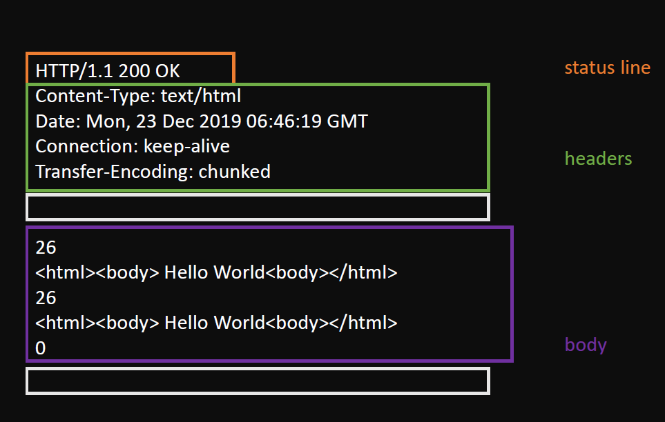
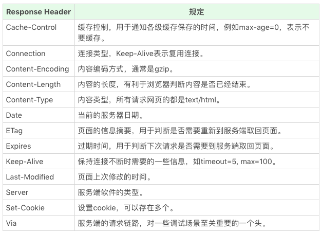

# HTTP 基础

HTTP 协议是基于 TCP 协议出现的，对 TCP 协议来说，TCP 协议是一条双向的通讯通道，HTTP 在 TCP 的基础上，规定了 Request-Response 的模式。这个模式决定了通讯必定是由浏览器端首先发起的。

## HTTP 协议格式

[rfc2616 标准](https://tools.ietf.org/html/rfc2616#section-6)

该标准中，用 `\r\n`表示 `CRLF`。在使用老式的机械打字机时，如果你想在下一行最左端开始继续打印，需要做两个动作：

1. CR: `\r`，先把机头重新推回最左侧，回到行首，这就是回车。
2. LF: `\n`，但是他还没有换行，然后再按一下换行键，使他往下移动一行，代表换行。

计算机刚产生的时候，主要还是文字界面，受打字机影响，也就有了这两个特殊字符。


### Request

```text
Request = Request-Line
          *(( general-header
            | request-header
            | entity-header ) CRLF)
          CRLF
          [ message-body ]
```


### Response



## HTTP method

- GET
- POST
- HEAD：与 GET 类似，但是只返回响应头
- PUT
- DELETE
- CONNECT：多用于 HTTPS 和 WebSocket
- OPTIONS
- TRACE

## HTTP Status Code 和 Status Text

- 1xx: 临时回应，表示客户端请继续。一般浏览器 HTTP 库会直接处理，所以平时见不到
- 2xx: 请求成功
  - 200: 请求成功
- 3xx: 请求目标资源有变化
  - 301: 目标资源永久性转移
  - 302: 目标资源临时性转移
  - 304: 客户端缓存没有更新
- 4xx: 客户端请求错误
  - 403: 无权限
  - 404: 页面不存在
- 5xx: 服务器请求错误
  - 500: 服务器端错误
  - 503: 服务器端暂时错误，可以一会再试

[在线模拟 HTTP 状态码](https://httpstat.us/)

## HTTP Head

HTTP 头可以看作一个键值对。重点的有：




## HTTP Body

- Request Body: 主要是提交 form 时使用。只要服务器端认可就可以。它的格式需要在 Request Header 里设置 content-type，常见格式为：
  - application/json
  - application/x-www-form-urlencoded
  - multipart/form-data
  - text/xml
- Response Body: 根据 Request Head 中的 Accept 等来决定 Response Body 类型

我们使用 HTML 的 form 提交产生的 HTTP 请求，默认会产生 application/x-www-form-urlencoded 的数据格式，当有文件上传时，则会使用 multipart/form-data。

form 表单提交的例子：

```javascript
fetch("/url", {
  method: "post",
  body: "firstName=Nikhil&favColor=blue&password=easytoguess", // 设置 Request Body
  headers: { "Content-type": "application/x-www-form-urlencoded" }, // 设置 Request Header 来告诉服务器Request Body的类型。
});
```
