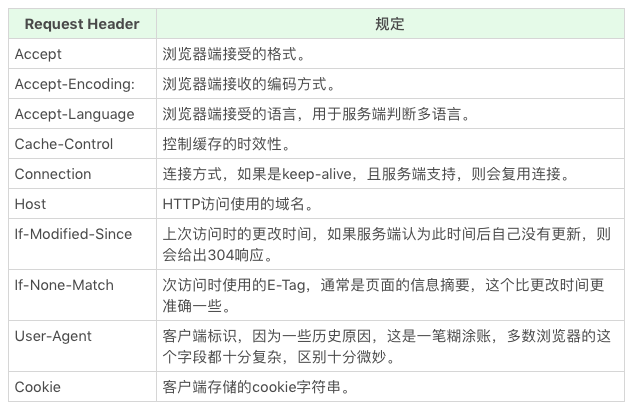

# HTTP 协议

HTTP 协议是出于应用层的，基于 TCP 协议出现。

## HTTP 协议格式


## HTTP 方法

- GET
- POST
- HEAD
- PUT
- DELETE
- CONNECT
- OPTIONS
- TRACE

## HTTP Status Code 和 Status Text

- 1xx: 临时回应，表示客户端请继续。一般浏览器 http 库会直接处理，所以平时见不到
- 2xx: 请求成功
  - 200: 请求成功
- 3xx: 请求目标资源有变化
  - 301: 目标资源永久性转移
  - 302: 目标资源临时性转移
  - 304: 客户端缓存没有更新
- 4xx: 客户端请求错误
  - 403: 无权限
  - 404: 页面不存在
- 5xx: 服务器请求错误
  - 500: 服务器端错误
  - 503: 服务器端暂时错误，可以一会再试

[在线模拟 HTTP 状态码](https://httpstat.us/)

## HTTP Head




## HTTP Body

- Request Body: 主要是提交 form 时使用。只要服务器端认可就可以。它的格式需要在 Request Header 里设置 content-type，常见格式为：
  - application/json
  - application/x-www-form-urlencoded
  - multipart/form-data
  - text/xml
- Response Body: 根据 Request Head 中的 Accept 等来决定 Response Body 类型

我们使用 HTML 的 form 提交产生的 HTTP 请求，默认会产生 application/x-www-form-urlencoded 的数据格式，当有文件上传时，则会使用 multipart/form-data。

举个 form 表单提交的例子：

```javascript
fetch("/url", {
  method: "post",
  body: "firstName=Nikhil&favColor=blue&password=easytoguess", // 设置 Request Body
  headers: { "Content-type": "application/x-www-form-urlencoded" } // 设置 Request Header 来告诉服务器Request Body的类型。
});
```
