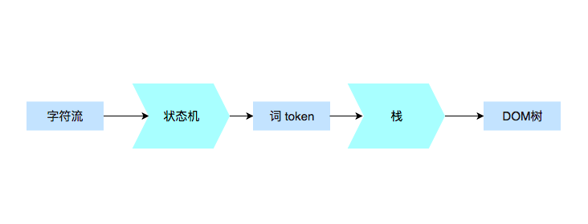

# 解析和构建 DOM

当浏览器拿到服务端返回的 HTML 文件流后，开始对 HTML 文件流进行解析和构建 DOM。

粗略地来说，就是 Response Body 返回回来的 HTML 字符流经过状态机处理，形成 tokens。然后通过栈构建 DOM。

## 状态机和 token

由于字符流是逐步进入的，下一个进来的字符会决定前面字符的 token 类型，所以用**状态机来创建 token**。图中，红色的 data 表示当前 HTML 字符流，表示当前状态机的初始状态。如果获得的是非 < 字符，当前当前字符流的 token 为文本。

HTML 的 token 主要有：

- “开始标签”的开始  
  `<abc`
- 属性  
  `a="xxx"`
- “开始标签”的结束  
  `/>`
- 文本  
  `hello world`
- 结束标签  
  `</abc>`
- 注释  
  `<!-- comment -->`
- CDATA 节点  
  `<![CDATA[hello world!]]>`

## 使用栈构建 DOM 树

当使用状态机创建 token 后，使用栈将 token 转化为 DOM 树。构建 DOM 树的过程就是使用算法将 token 构造成新的数据结构的过程。
