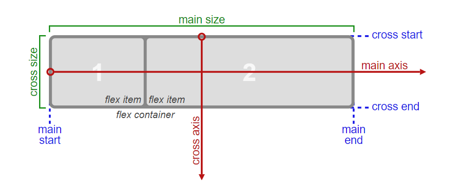

# 布局-渲染-合成-绘制

浏览器生成 DOM Tree 和 CSSOM Tree 后，生成 Render Tree。

## 排版布局(Layout)

说白了就是计算各个元素的位置。

Layout 可分为三代技术：

1. normal flow + float + position
2. **flex**
3. grid

生成 Render Tree 后，浏览器开始确定每一个元素的位置，也就是排版布局。

排版方式主要有：

- 正常流排版
- Flex 排版
- 浮动元素排版
- 绝对定位元素排版

### 正常流排版

浏览器最基本的排版方案是“正常流排版”。

```html
<!DOCTYPE html>
<html lang="en">
  <head>
    <meta charset="UTF-8" />
    <meta name="viewport" content="width=device-width, initial-scale=1.0" />
    <meta http-equiv="X-UA-Compatible" content="ie=edge" />
    <title>Document</title>
  </head>
  <body>
    <h1 style="color:red">元素(盒模型)排版</h1>
    文字排版
    <div style="display: inline;">元素变为文字排版</div>
  </body>
</html>
```

#### 正常流中的文字排版

在正常流的文字排版中，文字不能通过 Dev Tool 的 Inspect 去获得，也没有样式，由浏览器自行决定展示的样子。正常流文字排版时，浏览器会从某个字体文件中获取文字的信息。

#### 正常流中的盒模型排版

在正常流中，元素或者伪元素，会以盒的形式跟文字一起排版。盒模型可分为：

- 块级盒
- 行内盒，排版时与文字排版类似

### 绝对定位元素

`position` 属性为 `absolute` 的元素，我们需要根据它的包含块来确定位置，这是完全跟正常流无关的一种独立排版模式，逐层找到其父级的 position 非 static 元素即可。

### 浮动元素排版

float 元素非常特别，浏览器对 float 的处理是先排入正常流，再移动到排版宽度的最左 / 最右（这里实际上是主轴的最前和最后）。移动之后，float 元素占据了一块排版的空间，因此，在数行之内，主轴方向的排版距离发生了变化，直到交叉轴方向的尺寸超过了浮动元素的交叉轴尺寸范围，主轴排版尺寸才会恢复。float 元素排布完成后，float 元素所在的行需要重新确定位置。

### Flex 排版

Flex 排版，支持了 flex 属性，flex 属性将每一行排版后的剩余空间平均分配给主轴方向的 width/height 属性。浏览器支持的每一种排版方式，都是按照对应的标准来实现的。


flex 涉及的主要概念有：

- `flex container`：属性 `display: flex;` 的元素，元素当作一个容器
- `flex item`：flex container 中的各个元素
- `main axis`：flex container 中，flex items 的排布方向，也就是主轴方向
- `main-start`：flex container 中，flex items 沿主轴方向排布的开始位置
- `main-end`：flex container 中，flex items 沿主轴方向排布的结束位置
- `main-space`：flex container 中，flex items 沿主轴方向初始排布后，主轴方向的剩余尺寸
- `main-size`：flex item 占据主轴方向的尺寸
- `main-sign`：下一个 flex item 沿主轴方向的前进符号，分为 + 和 -
- `main-base`：下一个 flex item 沿主轴方向的基点

与 `main axis` 对应的概念还有 `cross axis`，表示与主轴方向垂直的交叉轴方向，它的理解方式与主轴一样。

flex container 的常用属性有：

- `flex-direction`：建立主轴，确定 flex items 的排布方向。
- `flex-wrap`：根据这个属性，确定 flex items 在一行内排布时，是重新开一个行，还是强行挤在原来的行里。
- `flex-flow`：`flex-direction` 和 `flex-wrap` 两者结合的语法糖。
- `justify-content`：确定当前行中，flex items 在主轴方向上的对齐方式，比如两端对齐等。会涉及到 `main-space`。
- `align-items`：确定当前行中，flex items 在交叉轴方向上的对齐方式，比如顶对齐、底对齐等。
- `align-content`：当有多个行时，多个行之间如果有空格，多个行在交叉轴方向上的对齐方式。也就是**确定行与行的对应关系**。

flex item 的常用属性有：

- `order`：当前 item 在当前行的出现次序
- `flex-grow`：当前 item 在当前行的的放大比例。如果所有项目的 `flex-grow` 属性都为 1，则它们将等分剩余空间（如果有的话）。如果一个项目的 `flex-grow` 属性为 2，其他项目都为 1，则前者占据的剩余空间将比其他项多一倍。
- `flex-shrink`: 当前 item 的缩小比例。如果所有项目的 `flex-shrink` 属性都为 1，当空间不足时，都将等比例缩小。如果一个项目的 `flex-shrink` 属性为 0，其他项目都为 1，则空间不足时，前者不缩小。
- `flex-basis`：当前 item 的 main size
- `flex`：是 `flex-grow`, `flex-shrink` 和 `flex-basis` 的语法糖
- `align-self`：当前 item 在交叉轴方向上的对齐方式，比如顶对齐、底对齐等。可参考 flex container 的 `align-items` 属性

可参考 [a-guide-to-flexbox](https://css-tricks.com/snippets/css/a-guide-to-flexbox/#flexbox-background)。

实现步骤：

1. 定义主轴、交叉轴
2. 收集元素进“行”

   根据元素的类别：

   - `no-wrap`，则强行分配进第一行
   - 非 `no-wrap`

     - flex 的
     - 非 flex 的

3. 计算主轴

   - 找出所有 flex 的，把主轴方向的剩余尺寸按比例分给它们
   - 若剩余空间为负数，所有 flex 的元素设为 0，等比压缩剩余元素
   - 根据对齐方式，确定元素具体位置

4. 计算交叉轴

   - 根据每一行中最大元素尺寸计算行高
   - 根据行高以及对齐方式，确定元素具体位置

## 渲染(Render)

浏览器中渲染这个过程，就是把每一个元素对应的盒变成位图。这里的元素包括 HTML 元素和伪元素，一个元素可能对应多个盒（比如 `inline` 元素，可能会分成多行），每一个盒对应着一张位图。位图就是在内存中建立一张二维表格，将一张图片的每个像素对应的颜色保存进去。

渲染主要分为：

1. 图形渲染
2. 文字渲染

   通过字体库实现。

注意，我们这里讲的渲染过程，是不会把子元素绘制到渲染的位图上的，这样，当父子元素的相对位置发生变化时，可以保证渲染的结果能够最大程度被缓存，减少重新渲染。

## 合成(Composing)

合成不是浏览器的必须过程。渲染过程不会把子元素渲染到位图上面，合成的作用，就是为一些元素创造“合成后的位图”，把一部分子元素渲染到合成的位图上。

## 绘制

绘制是把位图最终绘制到屏幕上的过程。
